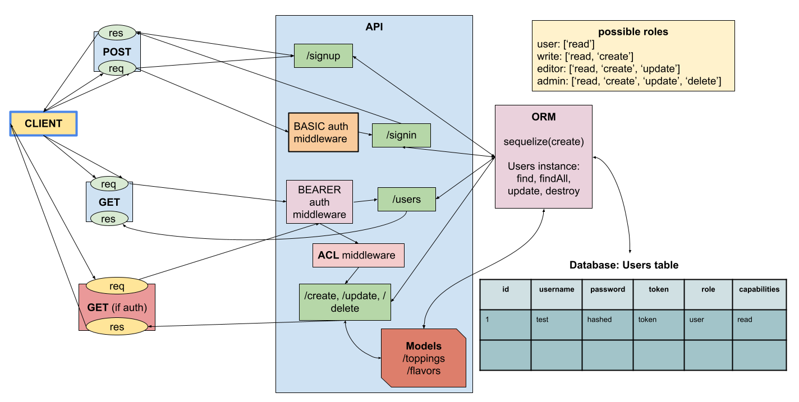

# LAB - Class 09

## Project: Auth Project

### Author: Katharine Swilley and Andrew Schiller

### Problem Domain

Create a new application using your API Server and Authentication System

### Links and Resources

- [ci/cd] (GitHub Actions)
- [back-end server](https://auth-project-d47.herokuapp.com/)

### Setup

#### `.env` requirements (where applicable)

None

#### How to initialize/run your application (where applicable)

- nodemon

#### How to use your library (where applicable)

#### Features / Routes

Specific routes to hit

- POST : `/signup`
- POST : `/signin`
- GET : `/users`
- GET : `/secret`

#### Tests

- Run tests using `npm test`

#### UML

